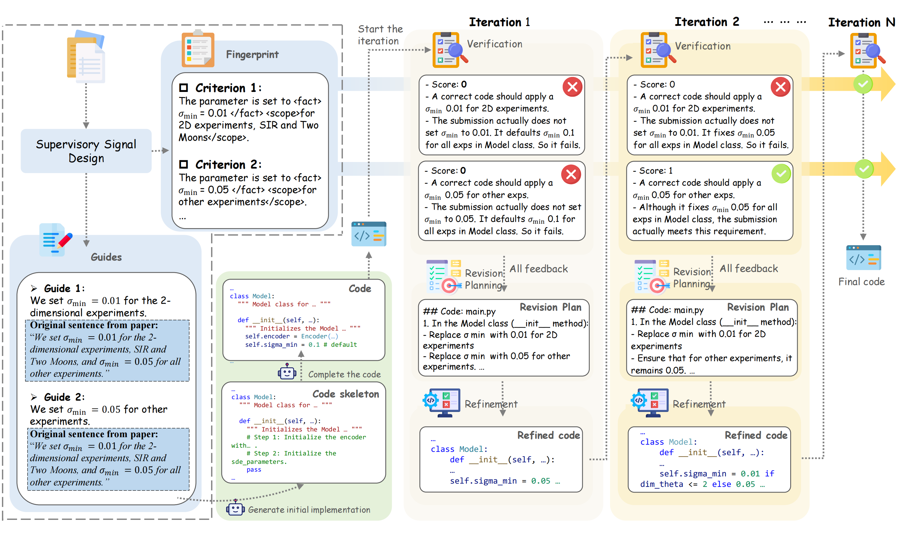

# RefP2C: Reflective Paper-to-Code Development Enabled by Fine-Grained Verification
**[RePro: Reflective Paper-to-Code Reproduction Enabled by Fine-Grained Verification]** [](https://arxiv.org/abs/2508.16671v1)

> *Note: This is an early draft. The updated version will be uploaded soon.*

Welcome to the RefP2C project! RefP2C aims to bridge the gap between research papers and their implementations. By combining **Supervisory Signal Design** and **Reflective Code Development**, RefP2C enables Agents to progressively develop high-fidelity machine learning projects directly from paper texts.

This repository presents our reflective paper-to-code development framework. The system consists of three key workflows: **Supervisory Signal Design**, **Initial Code Implementation**, and iterative **Code Reflection**. Among them, **Initial Code Implementation** and **Code Reflection** together form the **Reflective Code Development** process described in our paper.


---

## 🧩 Core Idea


---

## 📂 Project Structure

Here is an overview of the main directories and the roles they play within the RefP2C framework:

```
RefP2C/
├── model/                # Stores local embedding models for offline retrieval.
├── paper/                # Contains source documents for processing (e.g., <paper_id>/paper.md).
├── results/              # Main directory for all generated outputs from the pipelines.
├── scripts/              # High-level entry points for executing different workflow phases.
│ ├── generate_initial_code.py
│ ├── design_signals.py
│ ├── reflect_code.py
├── src/                  # Core implementation organized into multiple functional modules.
│ ├── core/               # Modules for the Initial Code Implementation pipeline.
│ ├── signals/            # Modules for the Supervisory Signal Design pipeline.
│ ├── reflection/         # Modules for the iterative Code Reflection pipeline.
│ ├── clients/            # API interface utilities.
│ ├── configs/            # Global constants.
│ ├── data_processing/    # Tools for parsing and processing paper content in Markdown format.
│ ├── prompts/            # Externalized LLM prompt templates.
│ └── utils/              # Shared utility modules (e.g., parsers, file I/O helpers).
├── requirements.txt
└── run.sh                # Main entry script for launching the full RefP2C pipeline.
```

---

## ⚙️ Installation

We recommend using Python 3.10 and `conda` for environment management.

```bash
conda create -n refp2c python=3.10
conda activate refp2c

pip install -r requirements.txt
```

---

## 🚀 Quick Start

1. **Prepare the Paper**  
   Place your paper file in Markdown format under `paper/<paper_id>/paper.md`.

2. **Set Up Local Embedding Model**  
Download a SentenceTransformer model (e.g., [`all-MiniLM-L6-v2`](https://huggingface.co/sentence-transformers/all-MiniLM-L6-v2))  
and place it under: `model/`.

3. **Configure API Access**  
Open `run.sh` and fill in your OpenAI API key and base URL:
    ```bash
    export OPENAI_API_KEY=your_key_here
    export OPENAI_BASE_URL=your_base_url_here
    ```

4. **Run the Pipeline**
Simply execute:

    ```bash
    bash run.sh
    ```

The system will automatically perform Initial Code Implementation, Supervisory Signal Design, and Iterative Code Reflection. After execution, the generated code and verification results will be saved under `results/<workspace_dir>`.

---

## ⚙️ Configuration

All configurable options are defined at the top of `run.sh`, including:
- `PAPER_ID`: the identifier matching your paper folder
- `WORKSPACE_DIR`: working directory for outputs and logs
- `MODEL_PHASE_*`: model selections for each pipeline phase
- `MAX_ITERATIONS`: number of reflection cycles

Simply modify these variables in `run.sh` before execution.

---

